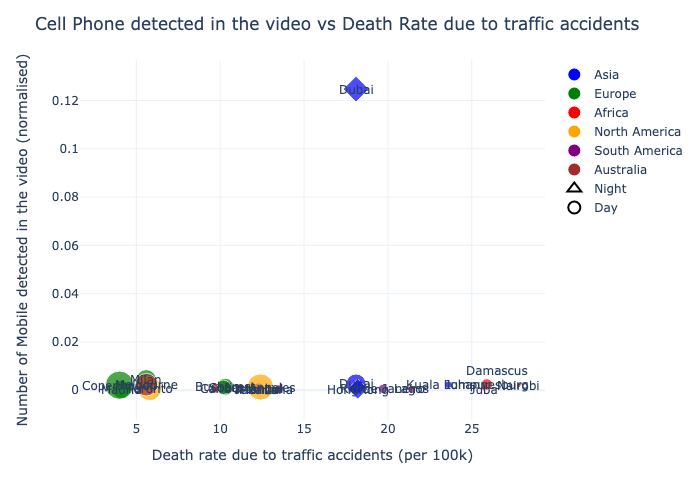

# youtube-pedestrian

## Overview
Welcome to the YOLOv8 YouTube Video Analysis project! This repository contains code that extracts YouTube videos based on a mapping.csv file and performs object detection using YOLOv8. The primary objective of this work is to evaluate pedestrian behavior in a cross-country or cross-cultural context using freely available YouTube videos.

## Usage of the code
The code is open-source and free to use. It is aimed for, but not limited to, academic research. We welcome forking of this repository, pull requests, and any contributions in the spirit of open science and open-source code 😍😄 For inquiries about collaboration, you may contact Pavlo Bazilinskyy (pavlo.bazilinskyy@gmail.com) or Md Shadab Alam (md_shadab_alam@outlook.com).

## Getting Started
Tested with Python 3.9.1. To setup the environment run these two commands in a parent folder of the downloaded repository (replace `/` with `\` and possibly add `--user` if on Windows:

**Step 1:**  

Clone the repository
```command line
git clone https://github.com/Shaadalam9/youtube-pedestrian.git
```

**Step 2:** 

Install Dependencies
```command line
pip install -r requirements.txt
```

**Step 3:**

Ensure you have the required datasets in the data/ directory, including the mapping.csv file.

**Step 4:**

Run the code:
```command line
python3 main.py
```

## License
This project is licensed under the MIT License - see the LICENSE file for details.

## Example

https://github.com/Shaadalam9/youtube-pedestrian/assets/88769183/5303f4a5-52a2-4230-bd05-89a53927a5be


##Results


[](https://github.com/Shaadalam9/youtube-pedestrian/tree/main/_outputscell_phone_vs_death.html)  
Average keypresses for all videos.

[](https://htmlpreview.github.io/?https://github.com/bazilinskyy/crossing-crowdsourcing/blob/main/figures/kp_videos.html)  
Individual keypresses for all videos.

[](https://htmlpreview.github.io/?https://github.com/bazilinskyy/crossing-crowdsourcing/blob/main/figures/kp_video_0.html)  
Keypresses for a selected video (video_0).

[](https://htmlpreview.github.io/?https://github.com/bazilinskyy/crossing-crowdsourcing/blob/main/figures/kp_and_traffic_rules.html)  
Keypresses in relation to traffic rules.

[](https://htmlpreview.github.io/?https://github.com/bazilinskyy/crossing-crowdsourcing/blob/main/figures/kp_or_cross_look.html)  
Keypresses in relation to the traffic signs.

[](https://htmlpreview.github.io/?https://github.com/bazilinskyy/crossing-crowdsourcing/blob/main/figures/scatter_avg_obj_surface-avg_kp.html)  
Relationship between mean keypresses of participants and mean surface area of objects.


## Contact
If you have any questions or suggestions, feel free to reach out to md_shadab_alam@outlook.com

