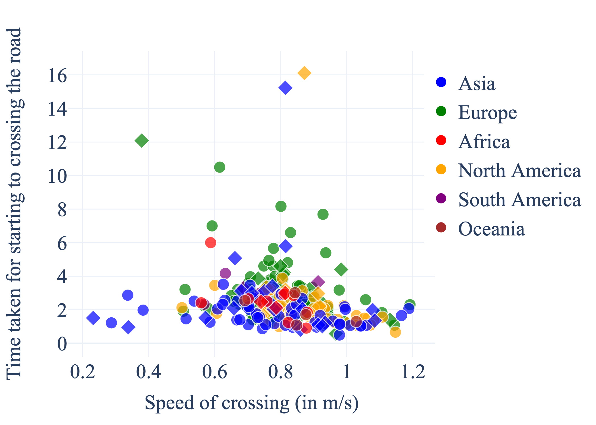
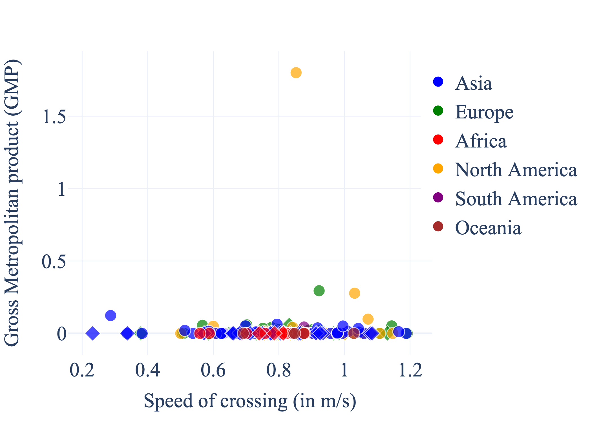
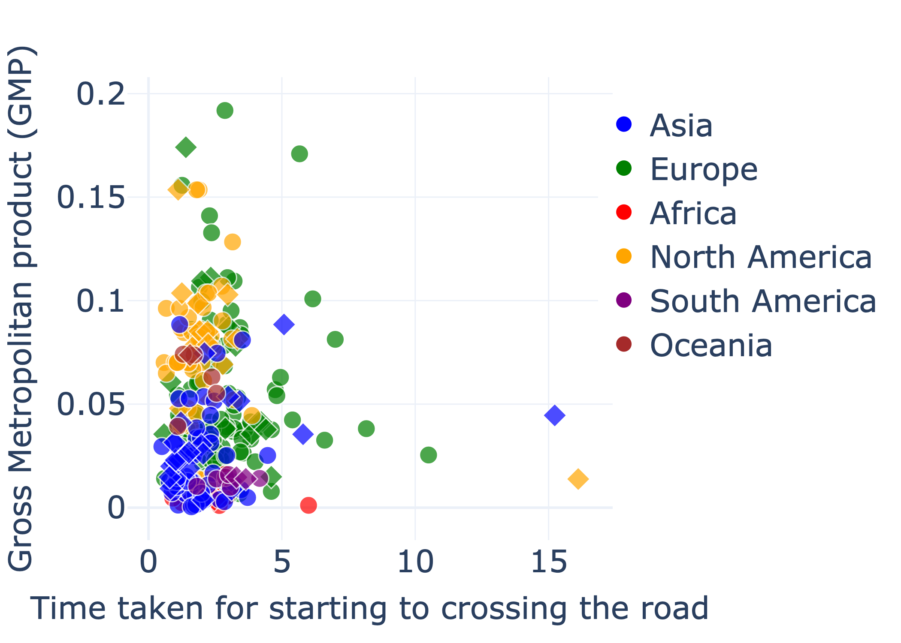
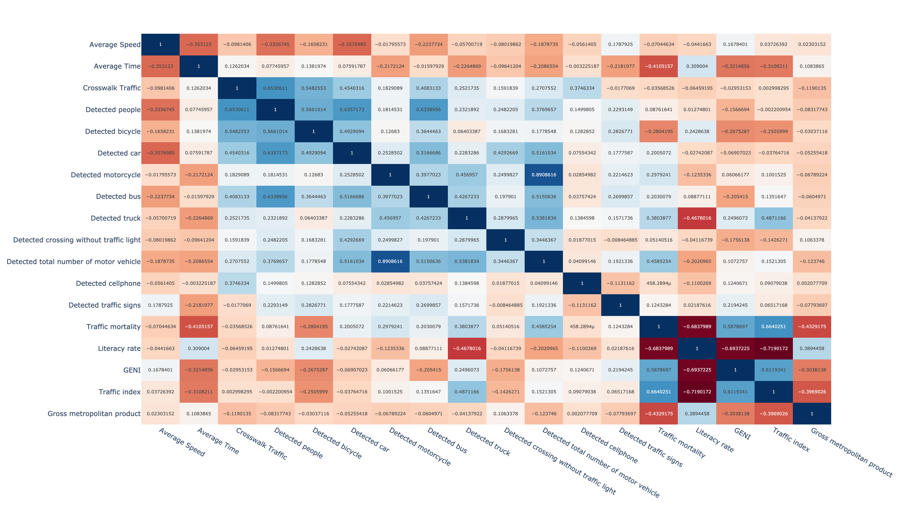
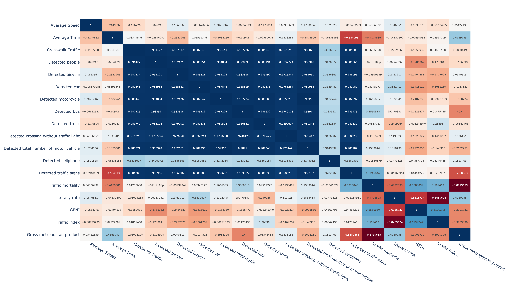
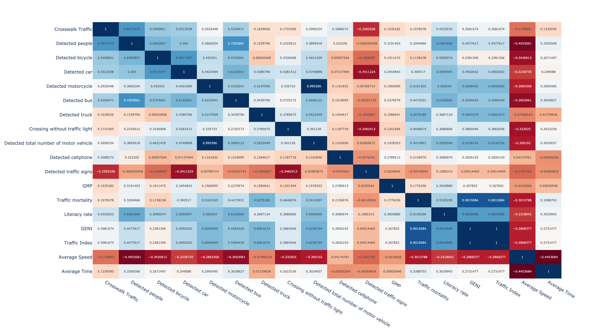

# youtube-pedestrian

## Overview
Welcome to the YOLOv8 YouTube Video Analysis project! This repository contains code that extracts YouTube videos based on a mapping.csv file and performs object detection using YOLOv8. The primary objective of this work is to evaluate pedestrian behavior in a cross-country or cross-cultural context using freely available YouTube videos.

This study presents a comprehensive cross-cultural evaluation of pedestrian behavior during road crossings, examining variations between developed and developing states worldwide. As urban landscapes evolve and autonomous vehicles (AVs) become integral to future transportation, understanding pedestrian behavior becomes paramount for ensuring safe interactions between humans and AVs. Through an extensive review of global pedestrian studies, we analyse key factors influencing crossing behavior, such as cultural norms, socioeconomic factors, infrastructure development, and regulatory frameworks. Our findings reveal distinct patterns in pedestrian conduct across different regions. Developed states generally exhibit more structured and rule-oriented crossing behaviors, influenced by established traffic regulations and advanced infrastructure. In contrast, developing states often witness a higher degree of informal and adaptive behavior due to limited infrastructure and diverse cultural influences. These insights underscore the necessity for AVs to adapt to diverse pedestrian behaviors on a global scale, emphasising the importance of incorporating cultural nuances into AV programming and decision-making algorithms. As the integration of AVs into urban environments accelerates, this research contributes valuable insights for enhancing the safety and efficiency of autonomous transportation systems. By recognising and accommodating diverse pedestrian behaviors, AVs can navigate complex and dynamic urban settings, ensuring a harmonious coexistence with human road users across the globe.

## Usage of the code
The code is open-source and free to use. It is aimed for, but not limited to, academic research. We welcome forking of this repository, pull requests, and any contributions in the spirit of open science and open-source code 😍😄 For inquiries about collaboration, you may contact Md Shadab Alam (md_shadab_alam@outlook.com) or Pavlo Bazilinskyy (pavlo.bazilinskyy@gmail.com).

## Getting Started
Tested with Python 3.9.19. To setup the environment run these two commands in a parent folder of the downloaded repository (replace `/` with `\` and possibly add `--user` if on Windows:

**Step 1:**
Clone the repository
```command line
git clone https://github.com/Shaadalam9/pedestrians-in-youtube.git
```

**Step 2:**
Create a new virtual environment
```command line
python -m venv venv
```

**Step 3:**
Activate the virtual environment
```command line
source venv/bin/activate
```

On Windows use
```command line
venv\Scripts\activate
```

**Step 4:**
Install dependencies
```command line
pip install -r requirements.txt
```

**Step 5:**
Ensure you have the required datasets in the data/ directory, including the mapping.csv file.

**Step 6:**
Run the code:
```command line
python3 analysis.py
```

- **`data`**: Directory containing data (CSV output from YOLO).
- **`videos`**: Directory containing the videos used to generate the data.
- **`mapping`**: CSV file that contains mapping data for the cities referenced in the data.
- **`prediction_mode`**: Configures YOLO for object detection.
- **`tracking_mode`**: Configures YOLO for object tracking.
- **`display_frame_tracking`**: Displays the frame tracking during analysis.
- **`save_annotated_img`**: Saves the annotated frames produced by YOLO.
- **`delete_labels`**: Deletes label files from YOLO output.
- **`delete_frames`**: Deletes frames from YOLO output.
- **`delete_youtube_video`**: Deletes saved YouTube videos.
- **`compress_youtube_video`**: Compresses YouTube videos (using the H.255 codec by default).
- **`delete_runs_files`**: Deletes files containing YOLO output after analysis.
- **`monitor_temp`**: Monitors the temperature of the device running the analysis.
- **`check_for_download_csv_file`**: Flag indicating whether any video listed in the mapping file is pending analysis.
- **`client`**: Specifies the client type for downloading YouTube videos; accepted values are `"WEB"`, `"ANDROID"` or `"ios"`.
- **`model`**: Specifies the YOLO model to use; supported/tested versions include `v8x` and `v11x`.
- **`countries_analyse`**: Lists the countries to be analysed.
- **`confidence`**: Sets the confidence threshold parameter for YOLO.
- **`update_ISO_code`**: Updates the ISO code of the country in the mapping file during analysis.
- **`update_pop_country`**: Updates the country’s population in the mapping file during analysis.
- **`update_continent`**: Updates the continent information in the mapping file during analysis.
- **`update_mortality_rate`**: Updates the mortality rate of the country in the mapping file during analysis.
- **`update_gini_value`**: Updates the GINI value of the country in the mapping file during analysis.
- **`update_upload_date`**: Updates the upload date of videos in the mapping file during analysis.
- **`update_fps_list`**: Updates the FPS (frames per second) information for videos in the mapping file during analysis.
- **`update_pytubefix`**: Updates the `pytubefix` library each time analysis starts.
- **`font_family`**: Specifies the font family to be used in outputs.
- **`plotly_template`**: Defines the template for Plotly figures.

## Example

Example of YOLO running on dashcam video (original video: https://www.youtube.com/watch?v=_Wyg213IZDI)
<a href="https://youtu.be/NipvoDg0Nyk">
  
</a>


## Results

Countries where the study has been conducted
[](https://htmlpreview.github.io/?https://github.com/Shaadalam9/youtube-pedestrian/blob/main/figures/world_map.html)

Time to start crossing(sorted by countries)
[](https://htmlpreview.github.io/?https://github.com/Shaadalam9/youtube-pedestrian/blob/main/figures/time_to_start_cross.html)

Speed of crossing(sorted by countries)
[](https://htmlpreview.github.io/?https://github.com/Shaadalam9/youtube-pedestrian/blob/main/figures/speed_of_crossing.html)

Time to start crossing(sorted by average of day and night)
[](https://htmlpreview.github.io/?https://github.com/Shaadalam9/youtube-pedestrian/blob/main/figures/time_to_start_cross_by_avg.html)

Speed of crossing(sorted by average of day and night)
[](https://htmlpreview.github.io/?https://github.com/Shaadalam9/youtube-pedestrian/blob/main/figures/speed_of_crossing_by_avg.html)

Merged figure of the speed of crossing and time to start crossing(sorted by countries)
[](https://htmlpreview.github.io/?https://github.com/Shaadalam9/youtube-pedestrian/blob/main/figures/consolidated.html)

Speed of crossing vs. time to start crossing
[](https://htmlpreview.github.io/?https://github.com/Shaadalam9/youtube-pedestrian/blob/main/figures/speed_vs_time.html)

Speed of crossing vs. Gross Metropolitan Product
[](https://htmlpreview.github.io/?https://github.com/Shaadalam9/youtube-pedestrian/blob/main/figures/gmp_vs_speed.html)

Time to start crossing vs. Gross Metropolitan Product
[](https://htmlpreview.github.io/?https://github.com/Shaadalam9/youtube-pedestrian/blob/main/figures/gmp_vs_cross_time.html)

Correlation Matrix
[](https://htmlpreview.github.io/?https://github.com/Shaadalam9/youtube-pedestrian/blob/main/figures/correlation_matrix_heatmap_averaged.html)

Correlation Matrix at day-time
[](https://htmlpreview.github.io/?https://github.com/Shaadalam9/youtube-pedestrian/blob/main/figures/correlation_matrix_heatmap_in_daylight.html)

Correlation Matrix at night-time
[](https://htmlpreview.github.io/?https://github.com/Shaadalam9/youtube-pedestrian/blob/main/figures/correlation_matrix_heatmap_in_night.html)

Correlation Matrix of Africa
[](https://htmlpreview.github.io/?https://github.com/Shaadalam9/youtube-pedestrian/blob/main/figures/correlation_matrix_heatmap_Africa.html)

Correlation Matrix of Asia
[](https://htmlpreview.github.io/?https://github.com/Shaadalam9/youtube-pedestrian/blob/main/figures/correlation_matrix_heatmap_Asia.html)

Correlation Matrix of Oceania
[](https://htmlpreview.github.io/?https://github.com/Shaadalam9/youtube-pedestrian/blob/main/figures/correlation_matrix_heatmap_Oceania.html)

Correlation Matrix of Europe
[](https://htmlpreview.github.io/?https://github.com/Shaadalam9/youtube-pedestrian/blob/main/figures/correlation_matrix_heatmap_Europe.html)

Correlation Matrix of North America
[](https://htmlpreview.github.io/?https://github.com/Shaadalam9/youtube-pedestrian/blob/main/figures/correlation_matrix_heatmap_North_America.html)

Correlation Matrix of South America
[](https://htmlpreview.github.io/?https://github.com/Shaadalam9/youtube-pedestrian/blob/main/figures/correlation_matrix_heatmap_South_America.html)

## Contact
If you have any questions or suggestions, feel free to reach out to md_shadab_alam@outlook.com

## License
This project is licensed under the MIT License - see the LICENSE file for details.
