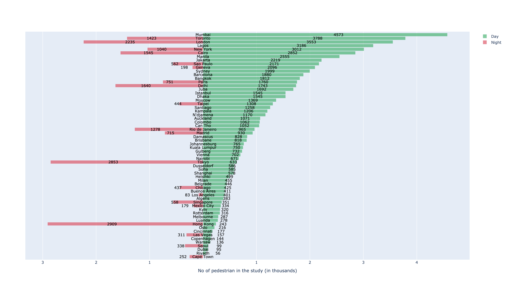
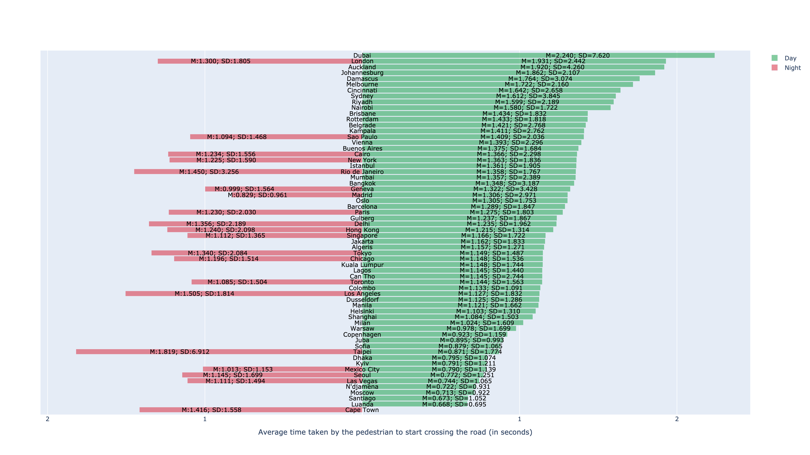
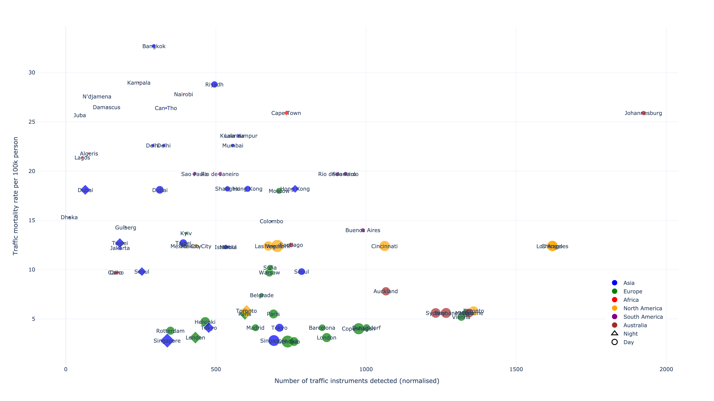
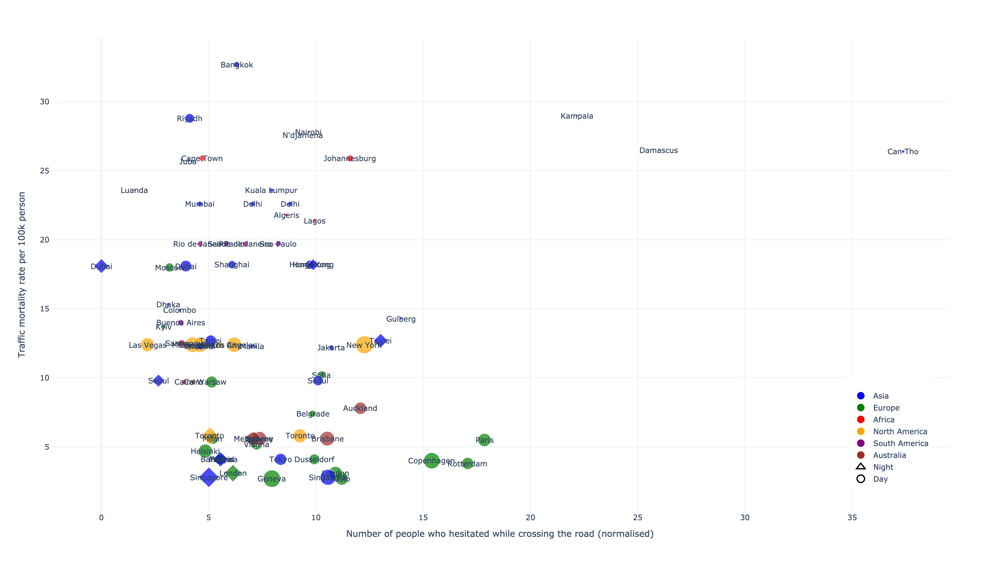
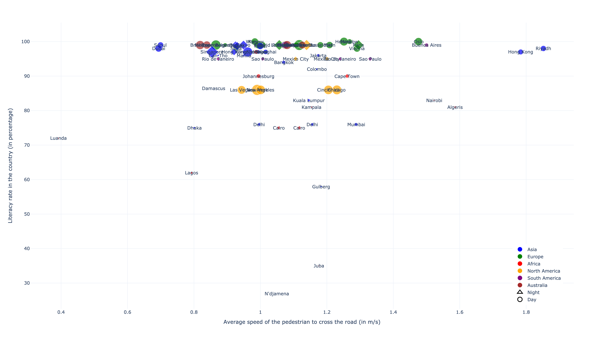
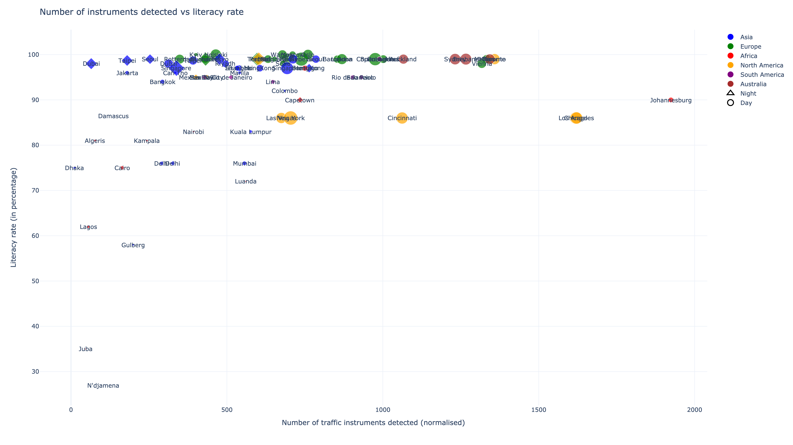
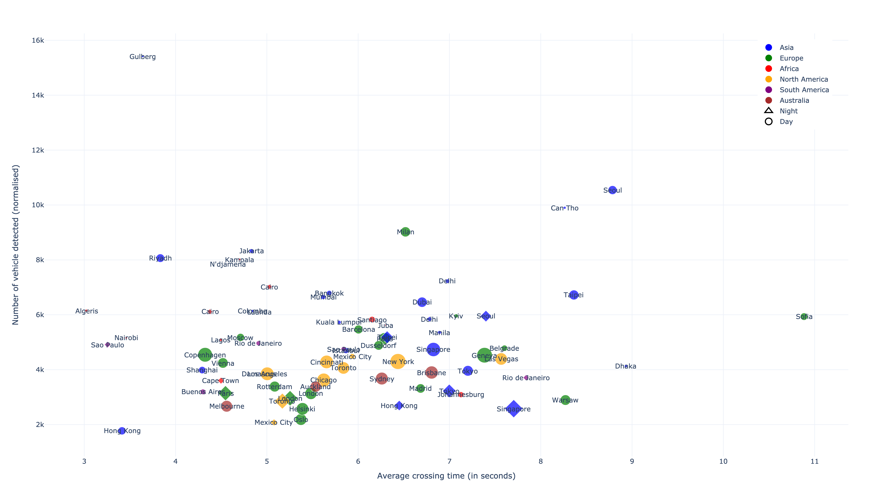

# youtube-pedestrian

## Overview
Welcome to the YOLOv8 YouTube Video Analysis project! This repository contains code that extracts YouTube videos based on a mapping.csv file and performs object detection using YOLOv8. The primary objective of this work is to evaluate pedestrian behavior in a cross-country or cross-cultural context using freely available YouTube videos.

This study presents a comprehensive cross-cultural evaluation of pedestrian behavior during road crossings, examining variations between developed and developing states worldwide. As urban landscapes evolve and autonomous vehicles (AVs) become integral to future transportation, understanding pedestrian behavior becomes paramount for ensuring safe interactions between humans and AVs. Through an extensive review of global pedestrian studies, we analyze key factors influencing crossing behavior, such as cultural norms, socioeconomic factors, infrastructure development, and regulatory frameworks. Our findings reveal distinct patterns in pedestrian conduct across different regions. Developed states generally exhibit more structured and rule-oriented crossing behaviors, influenced by established traffic regulations and advanced infrastructure. In contrast, developing states often witness a higher degree of informal and adaptive behavior due to limited infrastructure and diverse cultural influences. These insights underscore the necessity for AVs to adapt to diverse pedestrian behaviors on a global scale, emphasizing the importance of incorporating cultural nuances into AV programming and decision-making algorithms. As the integration of AVs into urban environments accelerates, this research contributes valuable insights for enhancing the safety and efficiency of autonomous transportation systems. By recognizing and accommodating diverse pedestrian behaviors, AVs can navigate complex and dynamic urban settings, ensuring a harmonious coexistence with human road users across the globe.

## Usage of the code
The code is open-source and free to use. It is aimed for, but not limited to, academic research. We welcome forking of this repository, pull requests, and any contributions in the spirit of open science and open-source code 😍😄 For inquiries about collaboration, you may contact Pavlo Bazilinskyy (pavlo.bazilinskyy@gmail.com) or Md Shadab Alam (md_shadab_alam@outlook.com).

## Getting Started
Tested with Python 3.9.1. To setup the environment run these two commands in a parent folder of the downloaded repository (replace `/` with `\` and possibly add `--user` if on Windows:

**Step 1:**  

Clone the repository
```command line
git clone https://github.com/Shaadalam9/youtube-pedestrian.git
```

**Step 2:** 

Install Dependencies
```command line
pip install -r requirements.txt
```

**Step 3:**

Ensure you have the required datasets in the data/ directory, including the mapping.csv file.

**Step 4:**

Run the code:
```command line
python3 main.py
```

## License
This project is licensed under the MIT License - see the LICENSE file for details.

## Example

https://github.com/Shaadalam9/youtube-pedestrian/assets/88769183/5303f4a5-52a2-4230-bd05-89a53927a5be


## Results


Number of pedestrian detected for crossing
[](https://htmlpreview.github.io/?https://github.com/Shaadalam9/youtube-pedestrian/blob/main/figures/no_of_cases_for_cross.html)

Time to start crossing
[](https://htmlpreview.github.io/?https://github.com/Shaadalam9/youtube-pedestrian/blob/main/figures/time_to_start_cross.html)  

Number of traffic safety equipment detected vs. traffic mortality rate
[](https://htmlpreview.github.io/?https://github.com/Shaadalam9/youtube-pedestrian/blob/main/figures/traffic_safety_vs_traffic_mortality.html)  

Number of people hesitated vs. Traffic mortality rate
[](https://htmlpreview.github.io/?https://github.com/Shaadalam9/youtube-pedestrian/blob/main/figures/hesitation_vs_traffic_mortality.html)  

Speed of crossing the road vs. Literacy rate of the country
[](https://htmlpreview.github.io/?https://github.com/Shaadalam9/youtube-pedestrian/blob/main/figures/speed_of_crossing_vs_literacy.html)

Number of traffic safety equipment detected vs. Literacy rate  of the country
[](https://htmlpreview.github.io/?https://github.com/Shaadalam9/youtube-pedestrian/blob/main/figures/traffic_safety_vs_literacy.html)  

Number of motor Vehicles detected vs. Average crossing time
[](https://htmlpreview.github.io/?https://github.com/Shaadalam9/youtube-pedestrian/blob/main/figures/all_vehicle_vs_cross_time.html)  

## Contact
If you have any questions or suggestions, feel free to reach out to md_shadab_alam@outlook.com

